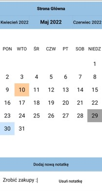
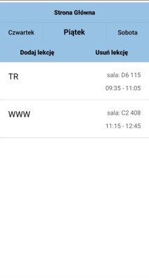
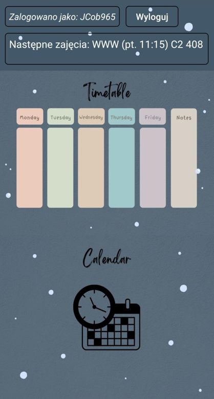

#  SmartStudy - Scheduling App  

## Table of contents
* [General info](#general-info)
* [Features](#features)
* [Technologies](#technologies)
* [Requirements](#requirements)
* [Setup](#setup)
* [Sources](#sources)
* [Authors](#authors)

## General info
SmartStudy is an Android App which will help everyone to manage time and organise their plans. You can either schedule your week (add some lessons, their duration and placement) and prearrange your plans for next holidays (add note on every day of year).

## Features
- Adding/deleting notes in calendar
- Displaying a list of notes below the calendar

- Scheduling a week - adding lessons with necessary details
- Deleting lessons

- Displaying the next lesson

## Technologies
App was created with:
- Java 
- SQLite
- Canva (for themes)

## Requirements
- Android 11.0 or higher
- SDK version: 26 or higher

## Setup
To run this application, You have to download .apk file from the app_setup directory.
You can also test it on the Android Studio emulator by cloning the code. 

## Sources
This app is inspired by Calendar App for Android: [@codeWithCal](https://github.com/codeWithCal/CalendarTutorialAndroidStudio).

## Authors 
- [Zuzanna Pietrzak](https://github.com/zuza571)
- [Jakub Mazur](https://github.com/JakubMazur965)

